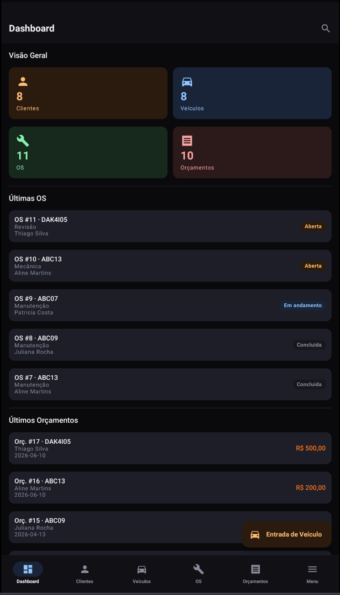
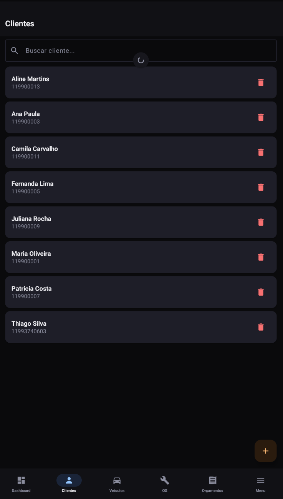
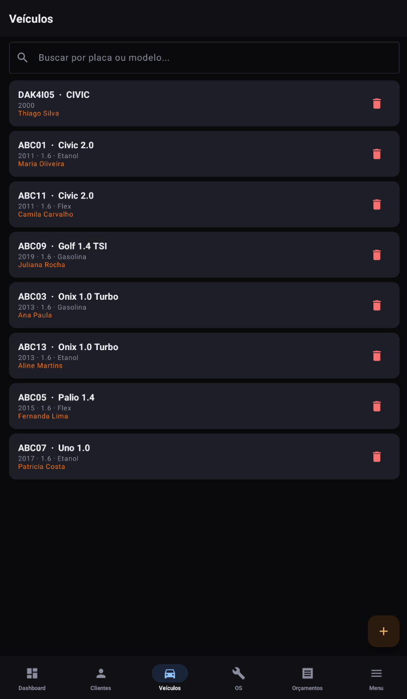
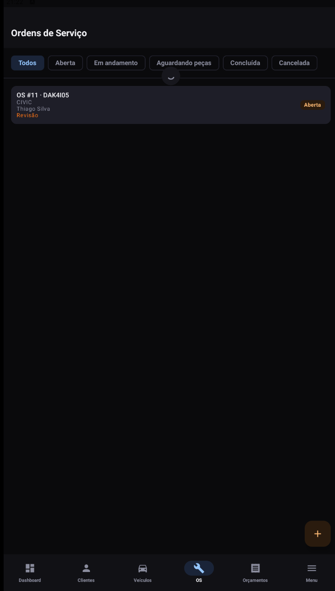
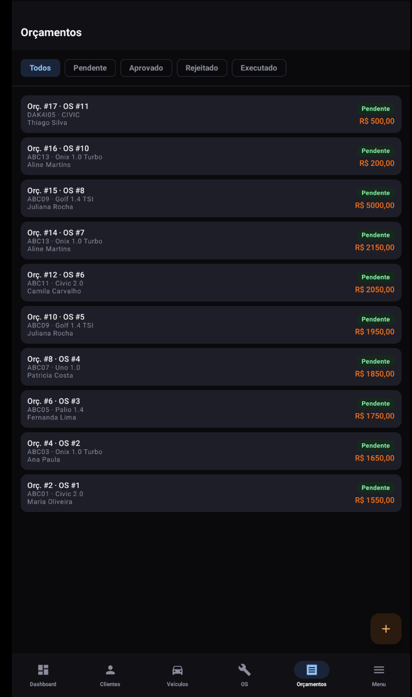
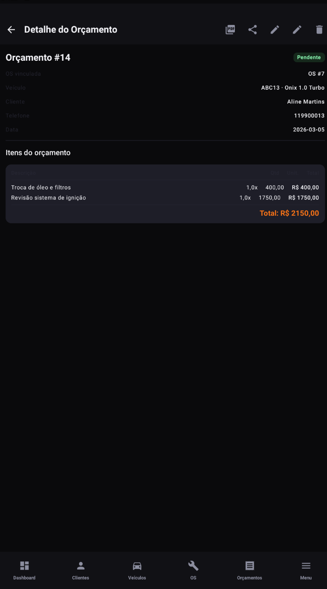
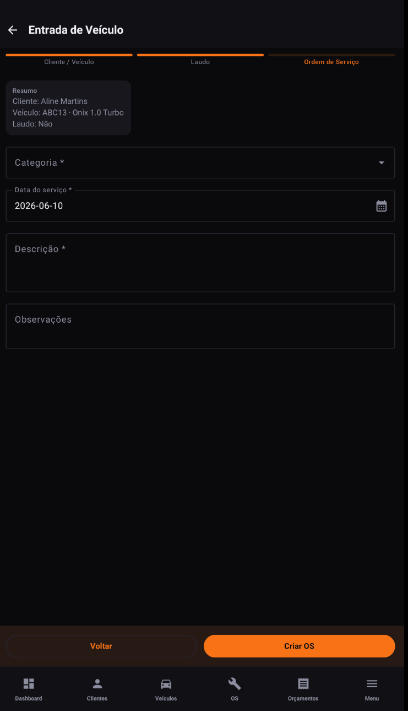

# CarbuApp – Mobile
### Sistema de Gestão para Oficinas Automotivas
**Projeto Integrador – UNASP 2026/1**

---

# Sobre o Projeto

O **CarbuApp** é um sistema de gestão para oficinas automotivas de pequeno porte. Este repositório contém o **aplicativo Android nativo**, desenvolvido em **Kotlin** com **Jetpack Compose**, que consome a mesma API REST utilizada pelo frontend web.

O app foi pensado para uso em campo pelo mecânico/gestor da oficina, permitindo consultar e atualizar informações mesmo com conexão instável, com suporte a **modo offline** via cache local.

Clientes de referência:
**Commenale Motorsports**
**Apocalypse Custom**

---

# Tecnologias Utilizadas

- **Kotlin 2.2.10**
- **Jetpack Compose** + **Material Design 3**
- **Navigation Compose** — navegação entre telas e bottom navigation
- **Hilt 2.59.2** — injeção de dependências
- **Room 2.8.0** — persistência local (cache offline)
- **Retrofit 2.11.0 + OkHttp 4.12.0 + Gson** — consumo da API REST
- **Coroutines + Flow (kotlinx.coroutines 1.8.1)** — programação assíncrona e reativa
- **Coil 2.6.0** — carregamento de imagens
- **DataStore Preferences + Security Crypto** — armazenamento seguro do token JWT
- **MockK + JUnit + Coroutines Test** — testes unitários
- Build: **Gradle 9.2.1 + AGP 9.0.1 + KSP 2.2.10-2.0.2**

---

# Arquitetura

O app segue **MVVM + Clean Architecture**, organizado em **módulos por feature** (package by feature). Cada módulo possui, conforme a necessidade:

```
<feature>/
  data/           # DTOs, ApiService (Retrofit), RepositoryImpl, local/ (Room DAO + Entity)
  domain/         # Repository (interface), model, usecase/
  ui/             # Screen (Composable) + ViewModel
  di/             # Módulo Hilt do feature
```

## Módulos implementados

- **auth** — login, sessão (DataStore + EncryptedSharedPreferences), Room (UserEntity)
- **dashboard** — resumo da oficina (totais, últimos registros)
- **clientes** — CRUD completo + cache Room
- **veiculos** — CRUD completo + detalhe (OS, orçamentos, timeline) + cache Room
- **ordens** (OS / RegistroTecnico) — listagem, detalhe, formulário, troca de status, entrada rápida
- **laudos** — laudo de entrada (avarias por zona) vinculado à OS
- **fotos** — galeria de fotos da OS (captura via câmera + upload)
- **orcamentos** — CRUD vinculado à OS, troca de status
- **templates** — templates de serviços reutilizáveis
- **usuarios** — gestão de usuários (ADMIN/SUPERADMIN)
- **oficina** — perfil da oficina e seleção de oficina (fluxo SUPERADMIN)
- **search** — busca global (clientes, veículos, OS, orçamentos)
- **menu** — menu principal / atalhos
- **core** — `database` (Room/AppDatabase), `network` (Retrofit/OkHttp/AuthInterceptor), `connectivity` (observador de rede), `data` (TokenDataStore), `di`, `util`

## Modo offline (Room)

O `AppDatabase` (versão 8) mantém entidades espelhando os principais recursos da API: `UserEntity`, `ClienteEntity`, `VeiculoEntity`, `OSEntity`, `OrcamentoEntity`, `LaudoEntity`, `AvariaEntity`, `FotoEntity`, `TemplateEntity`, `TemplateItemEntity`. Os repositórios fazem cache local dos dados consumidos da API, permitindo consulta offline.

O `NetworkConnectivityObserver` expõe o estado da conexão (`StateFlow<Boolean>`) via `ConnectivityManager`, usado para decidir entre dados locais e remotos.

## Navegação

`AppNavHost` + `Routes` (sealed class) definem todas as rotas do app. Fluxo principal:

```
Login → (SUPERADMIN? → Seleção de Oficina) → Main (Bottom Nav)
                                                 ├─ Dashboard
                                                 ├─ Clientes        (lista → detalhe → form)
                                                 ├─ Veículos        (lista → detalhe → form)
                                                 ├─ Ordens (OS)     (lista → detalhe → form / entrada rápida)
                                                 │     ├─ Laudo de Entrada
                                                 │     └─ Fotos
                                                 ├─ Orçamentos      (lista → detalhe → form)
                                                 └─ Menu
                                                       ├─ Busca global
                                                       ├─ Perfil da Oficina
                                                       ├─ Templates de Serviço
                                                       └─ Usuários (ADMIN/SUPERADMIN)
```

---

# Identidade Visual

A paleta de cores (`ui/theme/Color.kt`) foi extraída diretamente de `frontend/src/styles/global.css`, garantindo consistência visual entre Web e Mobile (tema escuro):

| Cor | Hex | Uso |
|---|---|---|
| `CarbuBg` | `#0A0A0C` | Fundo |
| `CarbuCard` / `CarbuCard2` | `#111115` / `#17171D` | Cards e superfícies |
| `CarbuPrimary` | `#F97316` | Marca (laranja) |
| `CarbuText` | `#F0F0F4` | Texto principal |
| `CarbuMuted` | `#8B8D9E` | Texto secundário |
| `CarbuBorder` | `#242430` | Bordas |
| `CarbuBlue` / `CarbuGreen` / `CarbuYellow` / `CarbuRed` | — | Status (Executado, Aprovado, Pendente, Rejeitado/erro) |

Ícone adaptativo (`ic_launcher`) também usa o fundo `#0A0A0C` da identidade visual da marca.

---

# Screenshots

> Capturas das principais telas, no mesmo layout/identidade visual implementado no app Android (Kotlin + Jetpack Compose).

| Dashboard | Clientes | Veículos |
|---|---|---|
|  |  |  |

| Ordens de Serviço | Orçamentos | Detalhe do Orçamento |
|---|---|---|
|  |  |  |

| Entrada de Veículo |
|---|
|  |

---

# Integração com Backend

API consumida: **`https://api.carbuapp.com.br/`** (mesma API do frontend web, Node.js + Express + Prisma + PostgreSQL).

Autenticação via **JWT**, enviado pelo `AuthInterceptor` em todas as requisições autenticadas. Suporte aos roles `SUPERADMIN`, `ADMIN`, `MECANICO`.

Repositório do backend: https://github.com/thiagoprsilva/carbuapp-backend
Repositório do frontend: https://github.com/thiagoprsilva/carbuapp-frontend

---

# Como Rodar o Projeto

## Pré-requisitos
- Android Studio (Ladybug ou superior)
- JDK 17 (recomendado: JBR do Android Studio)
- SDK Android: `compileSdk`/`targetSdk` 35, `minSdk` 26

## 1 - Abrir no Android Studio
Abrir a pasta raiz do projeto e aguardar o Gradle Sync.

## 2 - Rodar em modo debug
```bash
./gradlew assembleDebug
```
Ou usar o botão "Run" do Android Studio com um emulador/dispositivo conectado.

## 3 - Rodar testes unitários
```bash
./gradlew test
```

---

# Build de Release (APK assinado)

O `app/build.gradle.kts` define `signingConfigs.release`, que lê as credenciais de variáveis de ambiente:

```powershell
$env:JAVA_HOME = "C:\Program Files\Android\Android Studio\jbr"
$env:KEYSTORE_PATH = "<caminho-para-carbuapp.jks>"
$env:STORE_PASSWORD = "<senha>"
$env:KEY_ALIAS = "carbuapp"
$env:KEY_PASSWORD = "<senha>"

.\gradlew assembleRelease
```

APK gerado em `app/build/outputs/apk/release/app-release.apk`.

> O arquivo `carbuapp.jks` **não é versionado** (`.gitignore`). A geração de uma keystore nova invalida atualizações de uma instalação já existente — sempre reutilizar a mesma keystore.

## CI/CD

- **`ci.yml`** — em push/PR para `main`/`develop`: roda testes unitários e gera APK debug.
- **`release.yml`** — em push de tag `v*`: decodifica a keystore a partir do secret `KEYSTORE_BASE64` e gera AAB + APK de release assinados, publicando como GitHub Release.

---

# Status Atual do Mobile

✔ Setup do projeto (Gradle 9 / AGP 9 / Kotlin 2.2.10 / KSP / Hilt / Room)
✔ Identidade visual alinhada ao frontend (cores, tipografia, ícone)
✔ Módulo de autenticação (login, JWT, sessão segura)
✔ Módulo Clientes (CRUD + cache offline)
✔ Módulo Veículos (CRUD + detalhe + cache offline)
✔ Dashboard
✔ Ordens de Serviço (listagem, detalhe, form, entrada rápida, troca de status)
✔ Laudo de entrada (avarias por zona)
✔ Galeria de fotos da OS (câmera + upload)
✔ Orçamentos (CRUD vinculado à OS)
✔ Templates de serviços
✔ Busca global, perfil da oficina, seleção de oficina (superadmin), gestão de usuários
✔ Observador de conectividade (online/offline)
✔ Build de release assinado (APK) gerado para distribuição


---

# Informações Acadêmicas

**Curso:** Análise e Desenvolvimento de Sistemas
**Instituição:** UNASP
Thiago Pereira Silva RA:060242

Projeto Integrador – 2026/1
